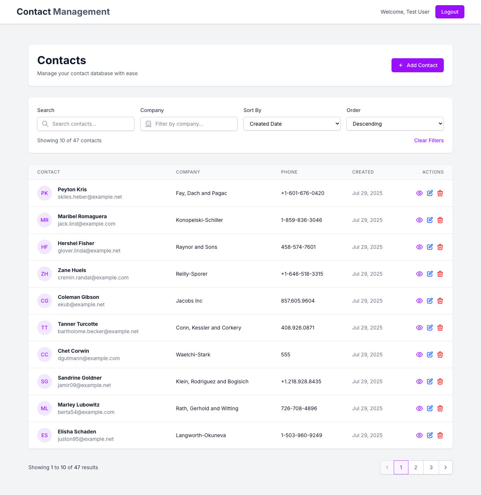
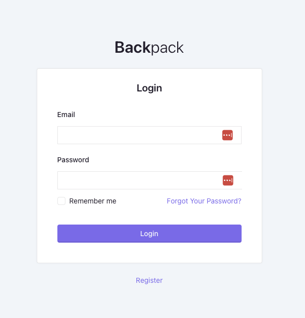
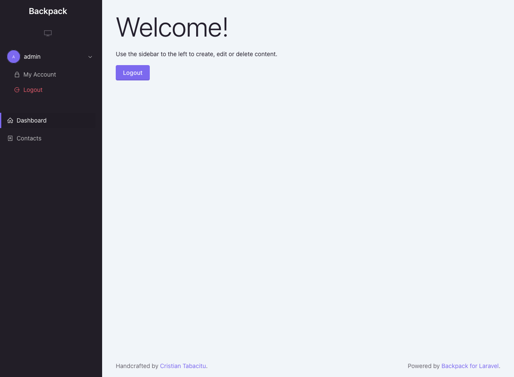

# Contact Management Frontend for Backpack Admin

A complete contact management system built with Laravel 12, Backpack v6, and Vue.js 3. This project provides both a Backpack admin panel for backend management and a modern Vue.js SPA frontend for user interactions.

## Backpack Admin Panel
- Access the admin panel at: `http://localhost:8000/admin`
- Login with the default credentials
- Navigate to "Contacts" to manage contacts via the admin interface

## Vue.js Frontend
- Access the frontend at: `http://localhost:8000`
- Login with the same credentials
- Use the modern interface to manage contacts

## Demo Server
- Backpack Admin
    - https://contact.ahmadlufiau.com/admin
    - User: admin@example.com
    - Pass: 123456789

- Vue.js Frontend
    - https://contact.ahmadlufiau.com
    - User: user@example.com
    - Pass: password

## API Endpoints

The system provides the following API endpoints (all require authentication):

- `POST /api/login` - User authentication
- `POST /api/logout` - User logout
- `GET /api/user` - Get authenticated user
- `GET /api/contacts` - List contacts (with search, filter, sort, pagination)
- `POST /api/contacts` - Create new contact
- `GET /api/contacts/{id}` - Get specific contact
- `PUT /api/contacts/{id}` - Update contact
- `DELETE /api/contacts/{id}` - Delete contact

For detailed API documentation, see `API_DOCUMENTATION.md`.

## Testing

Run the test:

```bash
# Run all tests
php artisan test

# Run specific test file
php artisan test tests/Feature/ContactApiTest.php

# Run all tests
npm run test
```

## Screenshot

### Frontend




### Backpack Admin Panel



